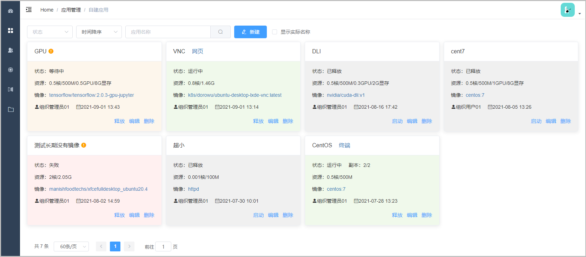
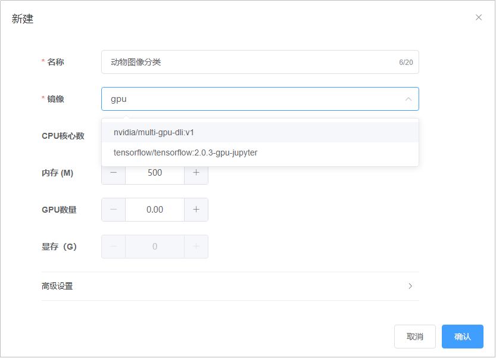
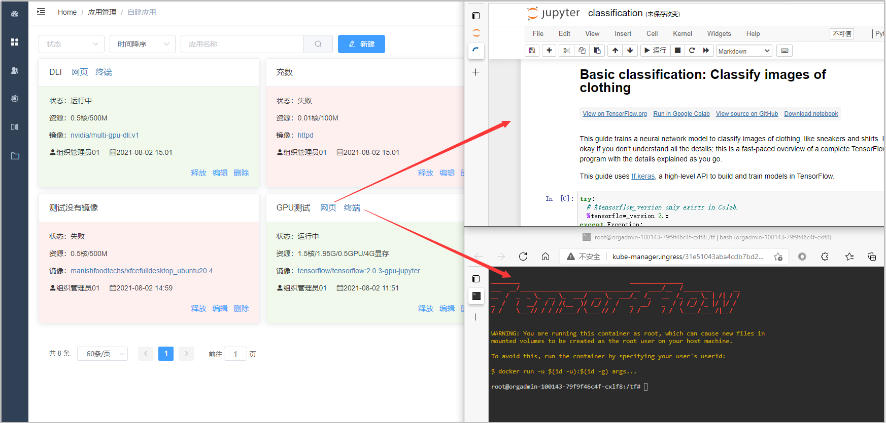
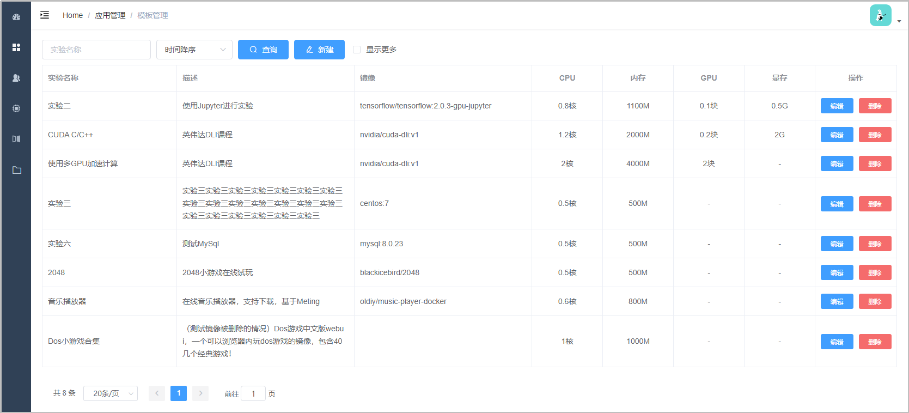
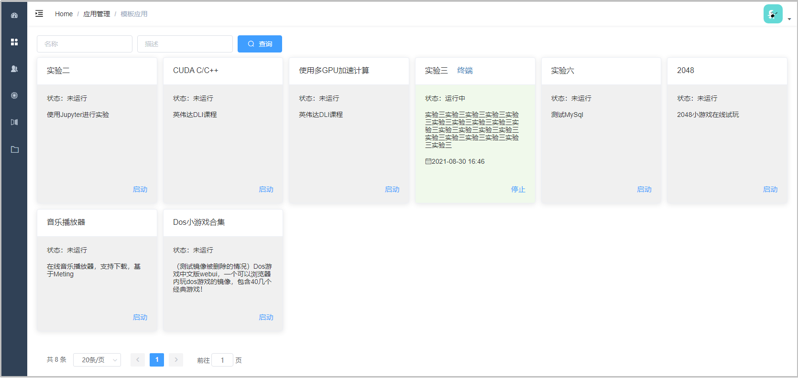

# 应用管理
## 自建应用
在此页面可以选择要使用的资源，新建应用（Deployment）。端口的配置在镜像管理中进行。

应用名称支持中文（不作为Deployment名称）。选择镜像时可以输入关键词进行模糊匹配。

CPU核心数的最小单位是千分之一核，一些微小的镜像可以仅使用千分之几的CPU。GPU数量可以使用单卡或多张整卡，如0.40代表限制单卡的40%利用率，3代表3张整卡。不使用整卡时请同时指定显存，建议GPU数量和显存的比例不要差距太大，使用整卡时显存会由系统自动设置。有些镜像必须配置GPU资源才能启动。

在高级设置中可以添加环境变量，请参照示例的格式填写。副本数一般设置为1，设置多个时可实现负载均衡，可用于无状态的应用（如微服务）。

启动完成后，根据镜像的配置，会出现“终端”和“网页”入口。有时因为容器启动后会有一些内部操作，需要数秒时间，请稍后再进入。VNC在初次访问时会有十几秒的白屏现象。

## 实验模板
实验模板能够帮助其他用户能够更快获得实验环境。组织管理员创建一个实验模板后，其他用户不必进行设置，可以直接启动。创建实验模板需要名称、描述、镜像、资源限制信息，在高级设置中也可以设置环境变量。

删除模板后，实验任务页面也会看不到相应的实验，如果模板正在使用，删除时系统会进行提示。删除模板不会结束容器, 因此建议实验全部停止后再删除模板，超管可以在Kubernetes仪表盘进行Pod清理工作。

## 模板应用
组织管理员维护实验模板后，组织内的用户可以点击“启动”，成功后会在名称旁边出现入口。从模板创建的应用不会计入配额。

