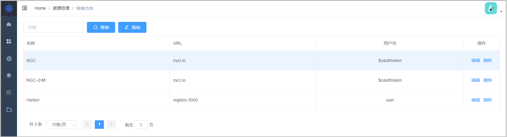
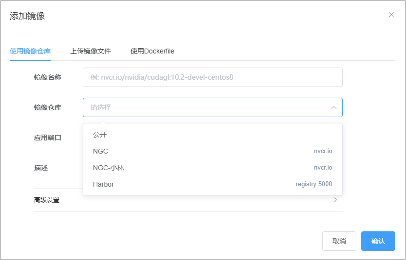
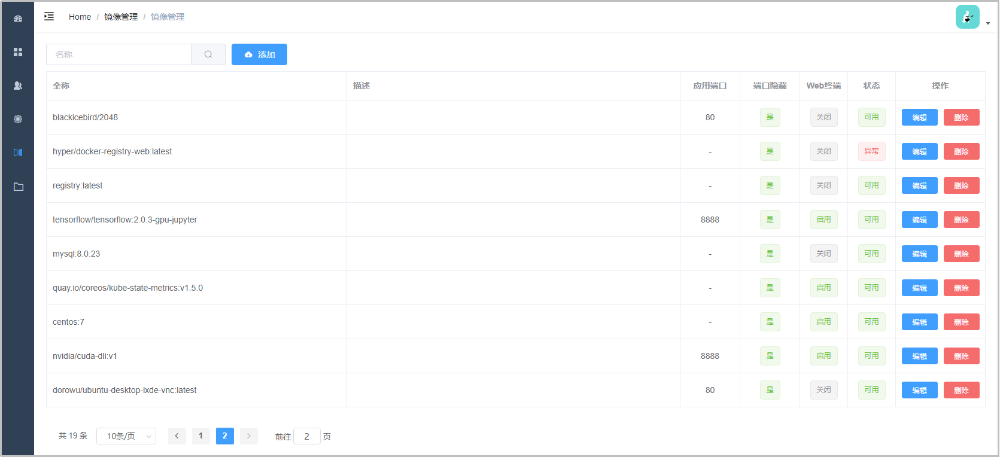
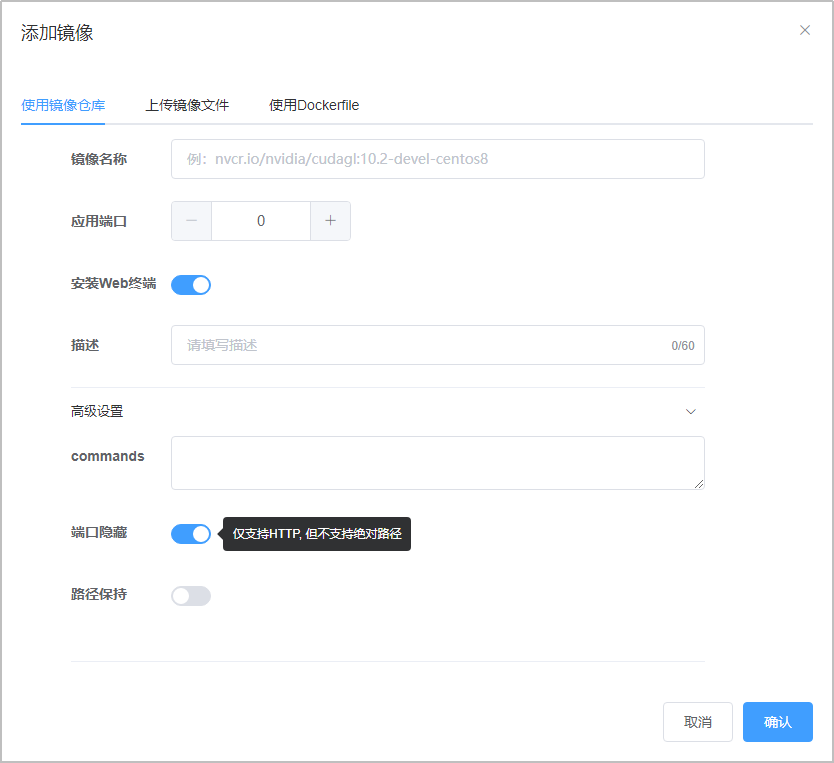
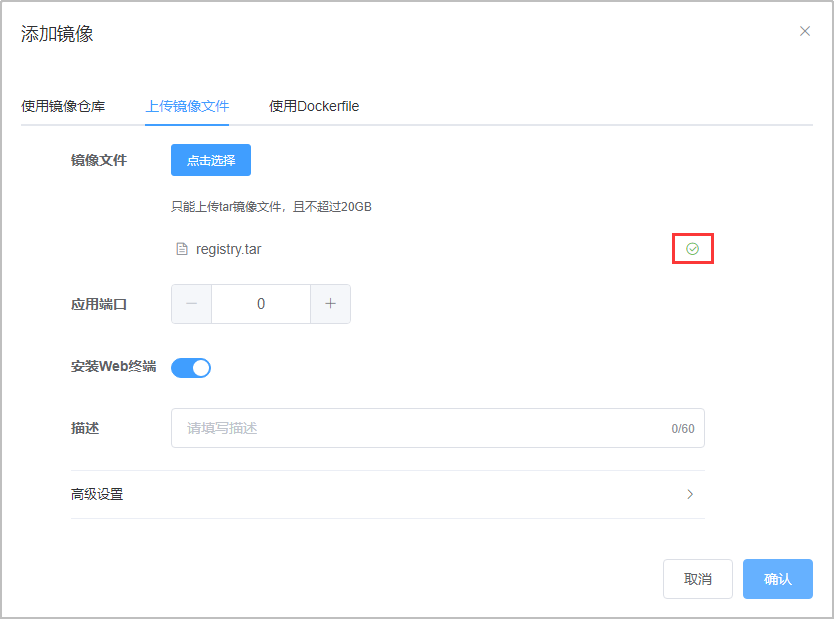
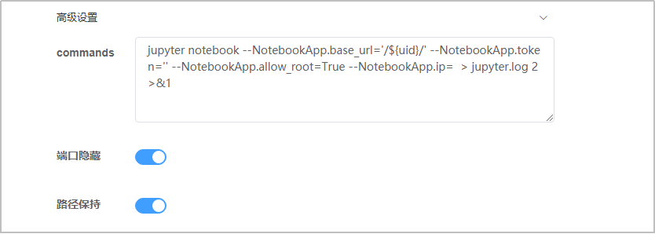

# 资源目录

## 镜像仓库

::: warning
仅向管理员开放。
:::

此页面可以添加镜像仓库及用户名密码，之后可以在镜像管理页面选用。不仅可以添加NGC的凭证，也可以使用Harbor、Docker Hub等。

添加仓库的凭证后，用户可以在“镜像管理”页面选择仓库，之后系统会使用相应的凭证下载镜像。

**参考：**
- [镜像管理](./catalog.md#镜像管理)

## 镜像管理

镜像管理用于引入镜像，并维护部分选项和配置，以便在应用管理功能中选用。

镜像管理页面有三种添加镜像的方式，分别为使用镜像仓库、上传镜像文件、使用dockerfile构建。服务器已有的镜像可以从“使用镜像仓库”添加。

Web应用端口多半为80，Jupyter默认8888，Cent OS等请填写0，表示不开启。可以选择安装WebSSH终端，此功能需要确保镜像支持curl命令，否则会导致容器启动失败。

当上传镜像文件进度达到100%时，可能还需要数秒的时间处理，完成后窗口会自动关闭。如果窗口未自动关闭，请等待文件右侧出现“√”标志再关闭。

高级设置中可以设置commands和路径保持，TCP暴露功能暂不支持。commands和docker -c 的作用相同，前台执行的命令常常会发生冲突，需要注意。

路径默认会被重写，如果不希望路径被重写，可以打开“路径保持”开关，目前仅发现Jupyter需要打开，其余默认即可。

