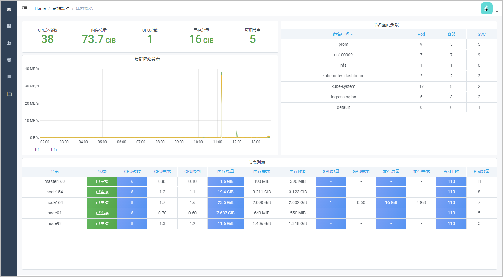
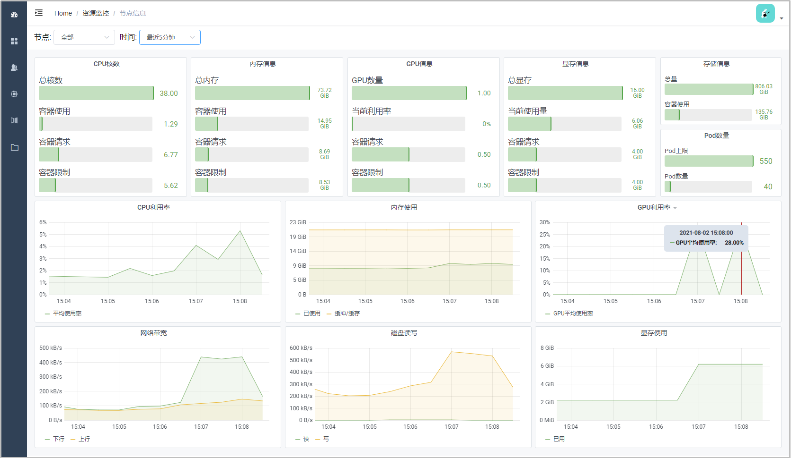
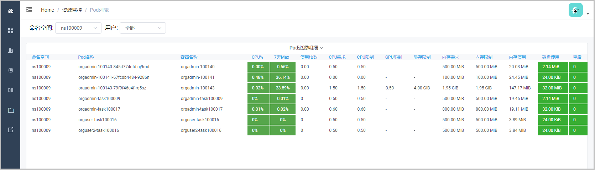
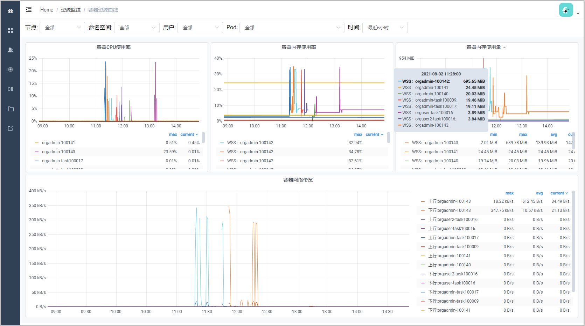

# 资源仪表盘
## 集群概览
集群概览展示了集群的总可用资源、各命名空间的负载、各个节点的基本状态。

## 节点信息
::: warning
仅向管理员开放。
:::

此页面展示了节点的已用、可用资源情况，以及一段时间内的资源使用曲线，可选择节点和时间段。

## Pod列表
::: warning
仅向管理员开放，系统管理员可以选择命名空间，组织管理员只能看到本组织所在的命名空间。
:::

此页面以列表的形式展示了Pod的资源需求和使用情况，帮助管理员判断资源是否在使用，以及资源需求是否合理。“7天Max”列表示一个Pod在7天内的CPU最大使用率，如果接近0则表示最近处于闲置状态。

## 容器资源曲线
::: warning
仅向管理员开放，系统管理员可以选择命名空间，组织管理员只能看到本组织所在的命名空间。
:::

此页面展示了一段时间内的容器资源使用曲线，包括CPU、内存和网络带宽。一个Pod通常对应一个容器，Pod有时会被重新创建，Pod名称改变但容器名保持不变，所以可能会看到一个容器的多段曲线。

