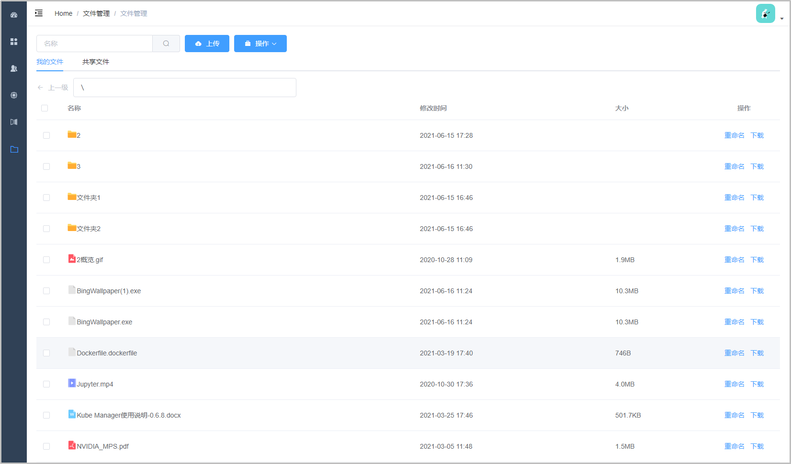
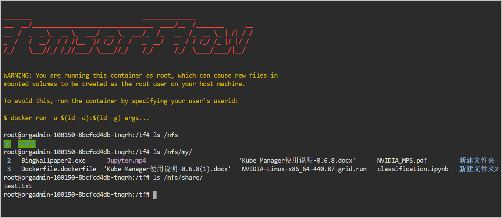

# 文件管理
此处的文件存储在NFS中，会被挂载到容器上。支持上传、下载、复制、剪切、删除、重命名，可以使用页面上方的下拉菜单进行操作，也可以使用右键菜单。右键时会自动勾选所在行，支持多选。
在路径栏可以直接输入路径，按回车键访问。在文件夹名称上单击即可访问文件夹，路径栏左侧按钮可以返回上一级。

文件分为“我的文件”和“共享文件”，共享文件全组织可见。两个文件夹会被挂载到容器的/nfs/my和/nfs/share路径。

