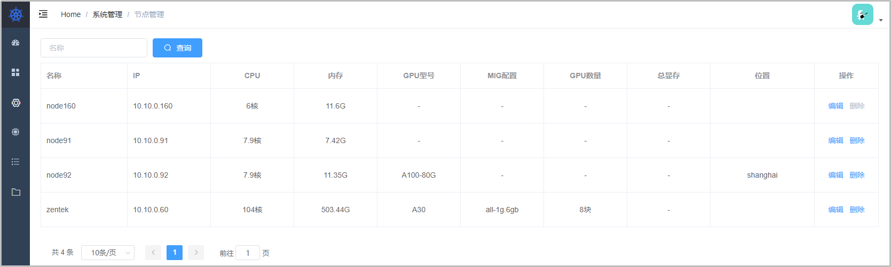
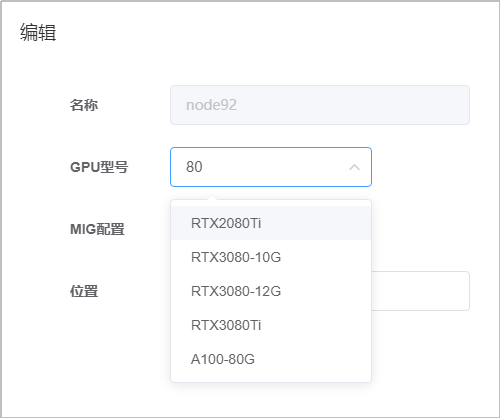
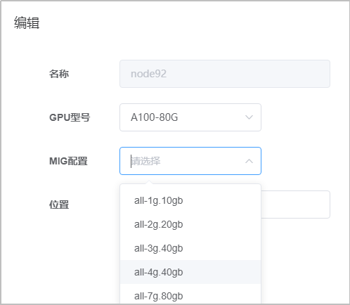
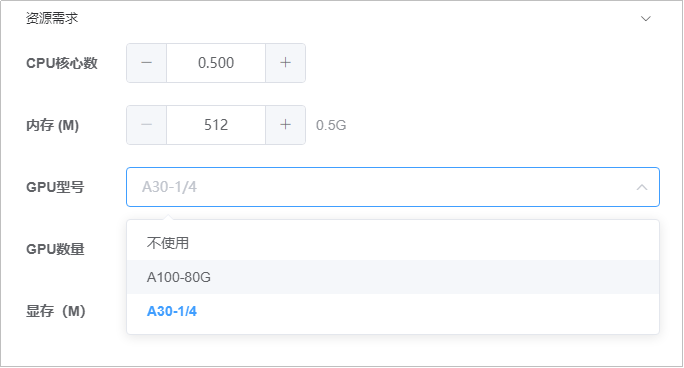
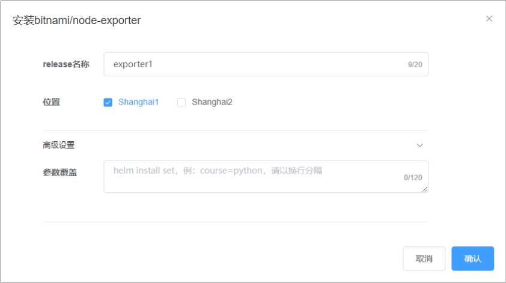

# 系统管理

## 节点管理

::: warning
仅向系统管理员开放。
:::

此页面可以维护节点配置，可以删除工作节点，节点的添加需要在各个节点内执行。

可以编辑节点的GPU型号。

部分型号支持MIG（多实例GPU）。

在创建应用时可以选择相应的配置。

**参考：**

- [自建应用](./application.md#自建应用)
- [实验模板](./application.md#实验模板)

编辑节点所属的位置后，在Helm charts页面可以进行选择。

## 组织管理

::: warning
仅向系统管理员开放。
:::

## 日志管理

::: warning
仅向系统管理员开放。
:::